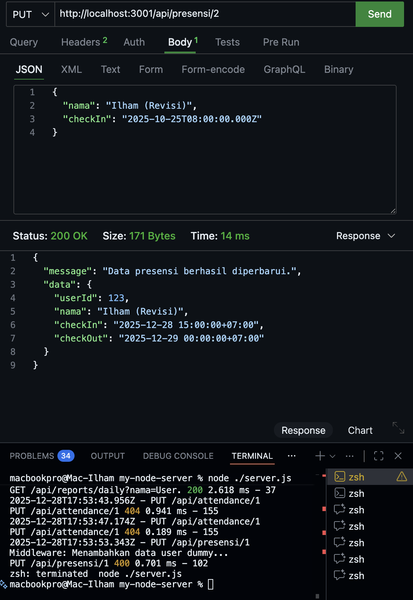
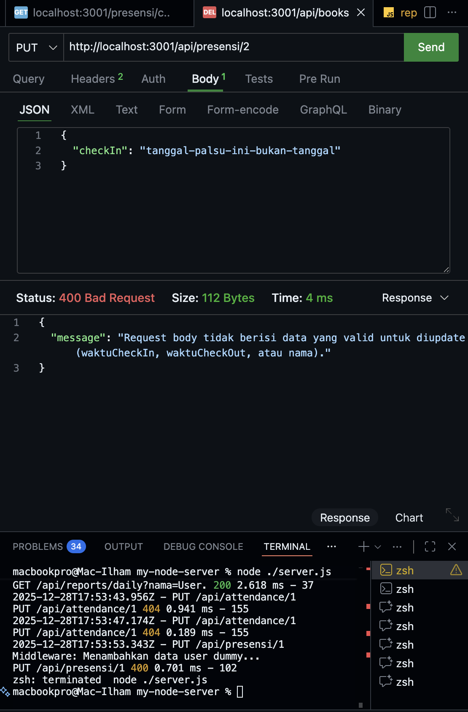
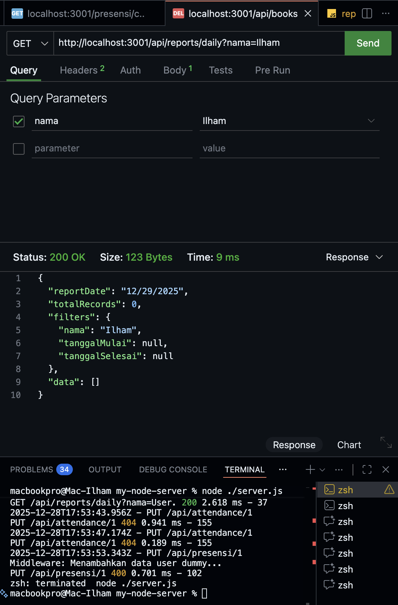

# Tugas 5 - Melengkapi RESTful API (Update, Delete, Search) dengan Sequelize

Nama : Ilham Fadhilah
NIM  : 20200140100

### 1. Endpoint update data presensi

### 2. Endpoint update jika format tanggal yang diisi tidak valid

### 3. Endpoint delete data

### 4. Enpoint search berdasarkan nama

### 5. Enpoint search berdasarkan tanggal
 
