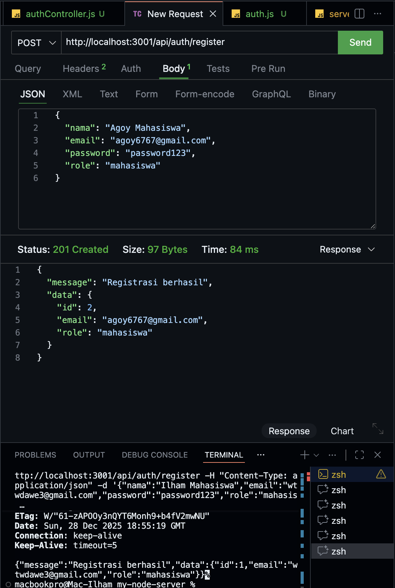
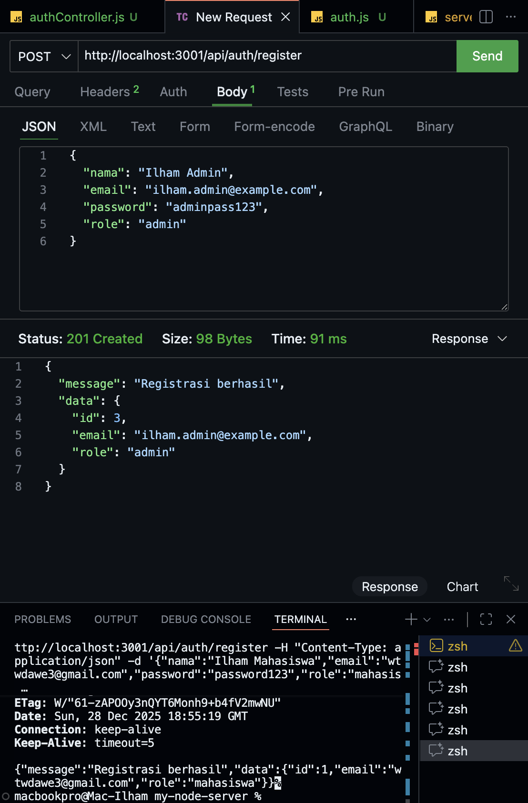
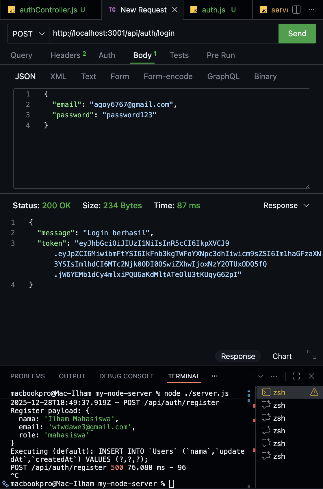
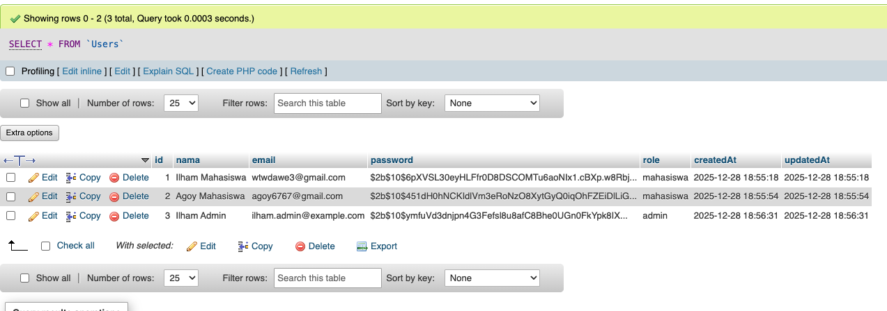

# Tugas 5 - Autentikasi API dengan JWT, Bcrypt, dan Role User

Nama : Ilham Fadhilah
NIM  : 20200140100

### 1. membuat user "mahasiswa"

### 2. membuat user "admin"

### 3. login sebagai "mahasiswa" 

### 4. Database table user
 

