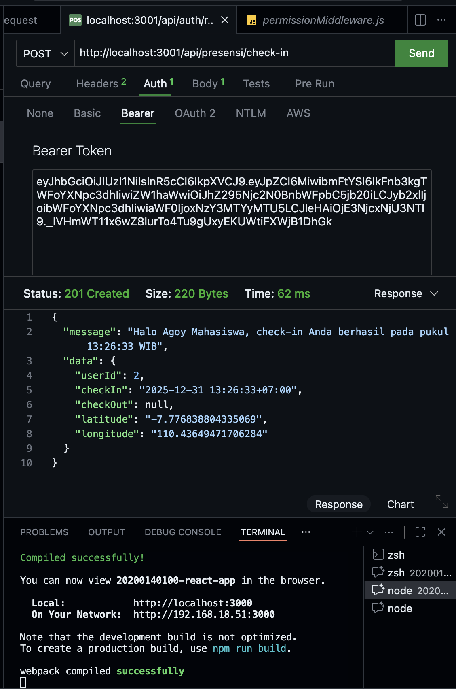
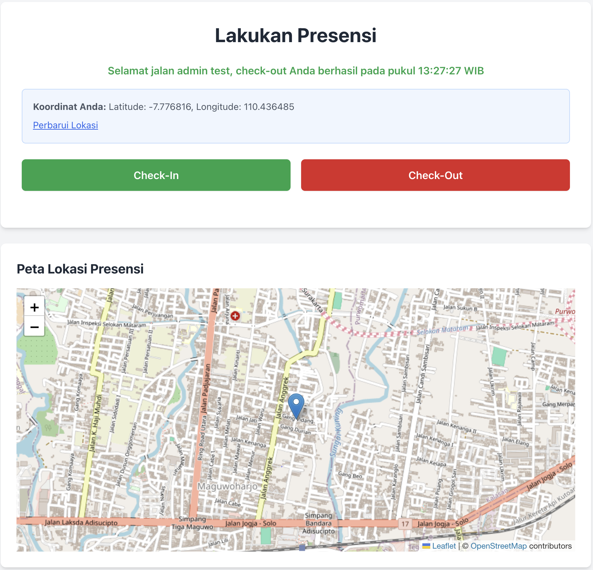

# Tugas 9 - Integrasi Final Full-Stack, Relasi Database, dan Geolocation

Nama : Ilham Fadhilah
NIM  : 20200140100

### 1. Endpoint presensi/check-in dengan menggunakan bearer token dan body latitude, longitude

### 2. Check-in berhasil

### 3. Check-out berhasil

### 4. tabel presensi

